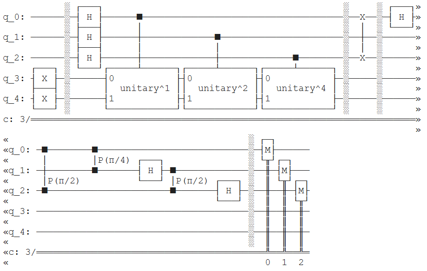
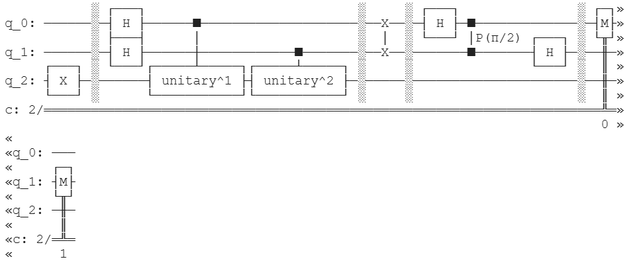

# $\text{Quantum Phase Estimation (QPE)}$


**Quantum Phase Estimation (QPE)** is a fundamental quantum algorithm used to estimate the eigenvalue (phase) of a unitary operator given its eigenvector. It plays a central role in many important quantum algorithms, including **Shor’s algorithm** and quantum simulations. This project implements QPE from scratch in a modular way using Qiskit and validates the results against NumPy-based eigenvalue and eigenvector calculations, demonstrating consistency with theoretical predictions.

## $\text{Purpose}$
The purpose of this project is to develop a clear and modular implementation of the **Quantum Phase Estimation (QPE)** algorithm from scratch using Qiskit, and to validate its correctness through numerical comparison with classical eigenvalue and eigenvector computations using NumPy. This work aims to provide a deeper understanding of phase estimation, quantum circuit construction, and the relationship between theoretical quantum mechanics and practical quantum simulation.

## $\text{Installation}$
Clone repository with git clone `https://github.com/celfienseptianwp/deutsch-jozsa.git` and use `pip install -r requirements.txt` in terminal to install dependencies.

## $\text{Success Indicators}$
- The implemented **Quantum Phase Estimation (QPE)** circuit correctly estimates the phase of given unitary operators.
- Measured results closely match the theoretical eigenvalues derived analytically.
- Numerical validation using NumPy eigenvalue and eigenvector calculations confirms the correctness of the quantum simulation.
- The modular implementation allows flexible testing with different unitary operators.
- Experimental results remain consistent across multiple runs and configurations.

## $\text{Result}$
The implemented **Quantum Phase Estimation (QPE)** algorithm successfully estimated the phases of the tested unitary operators, including the Pauli-Z and Controlled-X operators. The measured quantum outcomes were consistent with the theoretical predictions of the corresponding eigenvalues. Numerical verification using NumPy eigenvalue and eigenvector computations confirmed the correctness of the estimated phases. The modular implementation enabled flexible experimentation, and repeated runs produced stable and reliable results, demonstrating the validity of the approach.

<p align="center">
  <br>
  <em>Figure 1: Quantum Phase Estimation results for Controlled-X.</em>
</p>
<p align="center">
  <br>
  <em>Figure 2: Quantum Phase Estimation results for Pauli-Z.</em>
</p>

Based on the research that has been conducted, the following results were obtained:
| Unitary Operator | Classical Eigenvector | Quantum Eigenstate | Classical Eigenvalue | Quantum Eigenvalue |
|------------------|-----------------------|--------------------|----------------------|--------------------|
| Pauli-Z | `[0. 1.]` | `[0. 1.]` | -1 | -1 |
| Controlled-X | `[0. 0. 0. 1.]` | `[0. 0. 0. 1.]` | -1 | -1 |

Therefore, this study has satisfied the success indicator.

## $\text{File Structure}$
```text
├── assets/
│   ├── controlled-x.png
│   └── pauli-z.png
├── controlled-x_test.ipynb
├── pauli-z_test.ipynb
├── quantum-algorithms.py
├── README.md
└── requirements.txt
```

## $\text{References}$ 
Nielsen, M. A., & Chuang, I. L. (2010). Quantum Computation and Quantum Information (10th Anniversary ed.). Cambridge University Press.